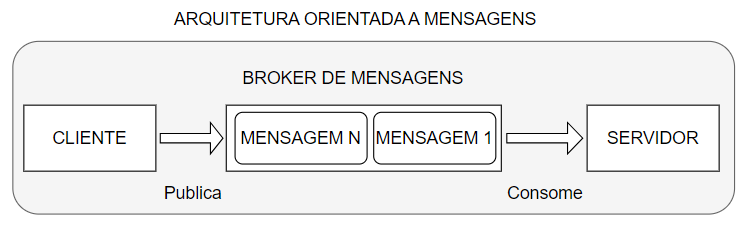

## About the project

This project examplifies the usage of message oriented architecture by building a chanel queue with **RabbitMQ**, and estabilishing a connection with a sender (client) and a receiver (server). The client is responsible for sending messages for the server using the queue created with RabbitMQ. The messages must be strings, and the receiver must have a callback function to handle those messages.



## Technologies

- RabbitMQ
- Python

## Dependencies

### Python version

Python 3.10

### Python Libs

```
pika
```

You can install these libs by using:

```
pip intall pika
```

### RabbitMQ

You can install RabitMQ using this link:

[Installing RabbitMQ](https://www.rabbitmq.com/install-windows.html#installer)

### Chocolatey (Optional)

In case you are installing RabbitMQ using chocolatey, you'll have to install chocolatey using this link:

[Installing chocolatey](https://community.chocolatey.org/courses/installation/installing)

## Folder structure

```Bash
|- message_oriented_architecture
|  |- receiver.py
|  |- sender.py
```

## How to run it

With one CMD, use this command to run de receiver script:

```
python receiver.py
```

With another CMD, use this command to run de receiver script:

```
python sender.py
```

Come back to the CMD executing the receiver script and see the "Hello world!" message printed on the terminal!
